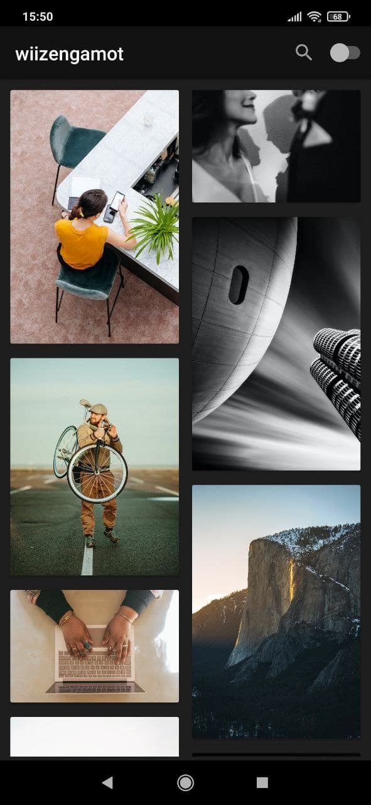
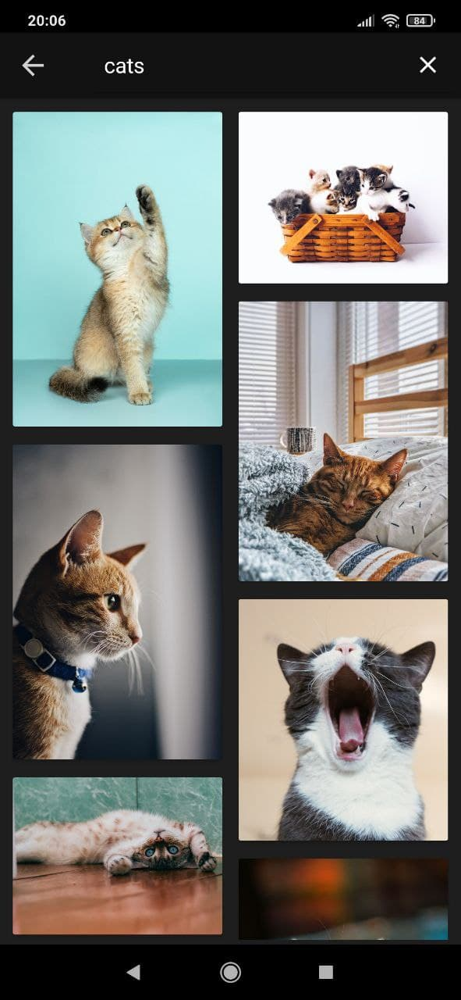
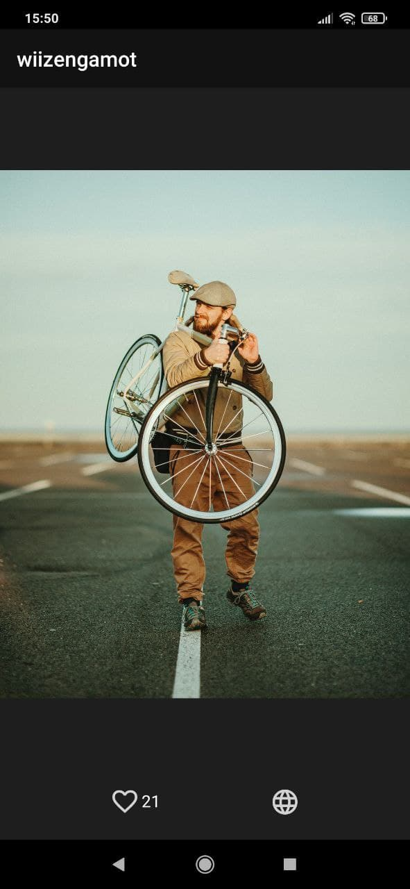
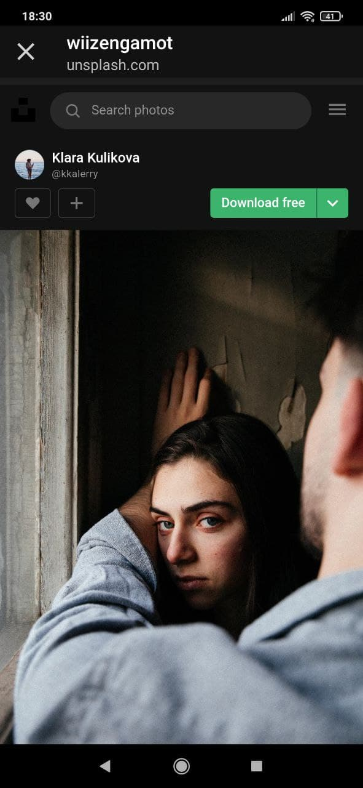
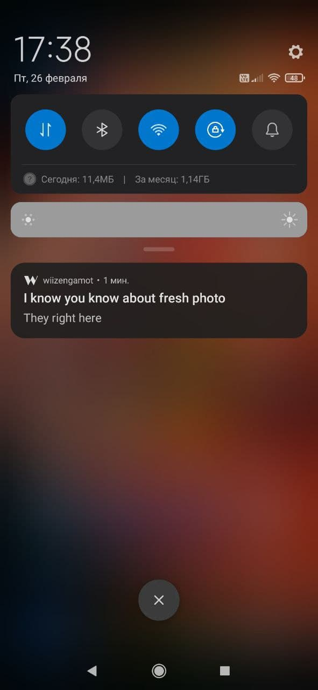

 
___
Android - application for viewing photos from [unsplash.com](https://unsplash.com)

#### *Using stack:* 

1. Android SDK
2. Kotlin
3. Retrofit2
4. RxJava
5. Fragment Result API
6. WorkManager API & BroadcastReceivers (for notifications)
7. Picasso
8. Gson
9. Dagger2
10. Architecture MVP

#### Wi. App Screenshots

<table style="border: 0px solid transparent;">
  <tr align="center">
    <td>All</td>
    <td>Find</td>
  </tr>
  <tr>
    <td></td>
    <td></td>
  </tr>
  <tr align="center">
    <td>Detail</td>
    <td>Web View</td>
  </tr>
  <tr>
    <td></td>
    <td></td>
  </tr>
  <tr align="center">
     <td>Notification</td>
  </tr>
  <tr>
     <td></td>
  </tr>
</table>